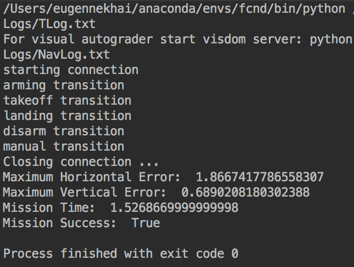
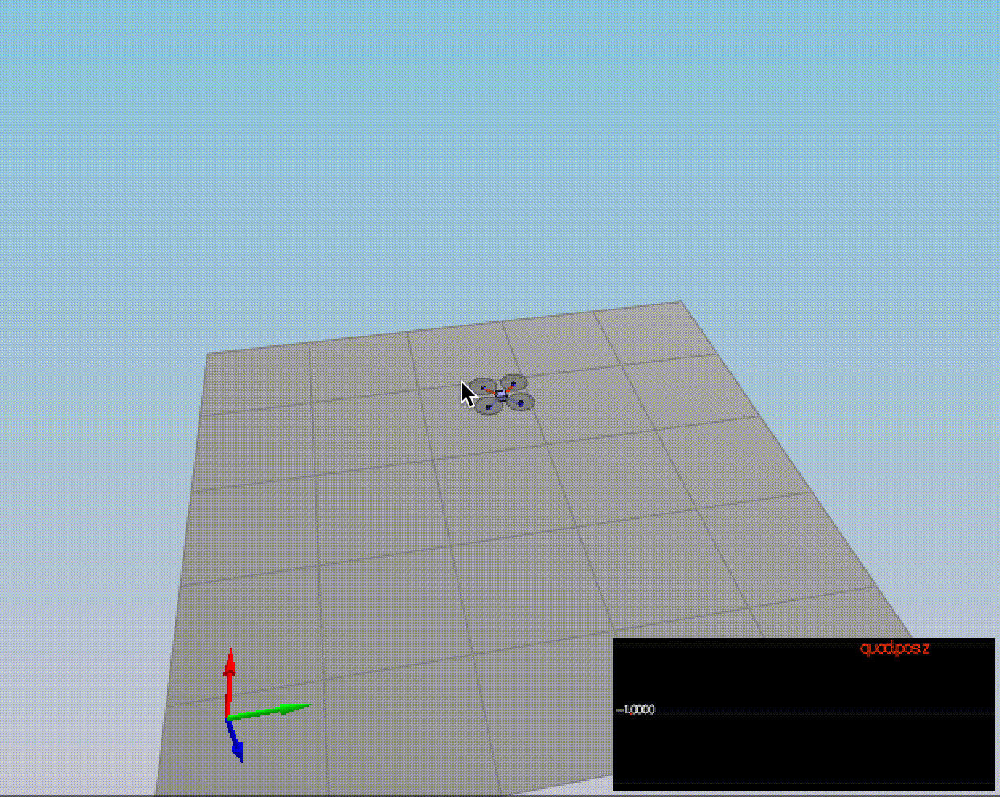
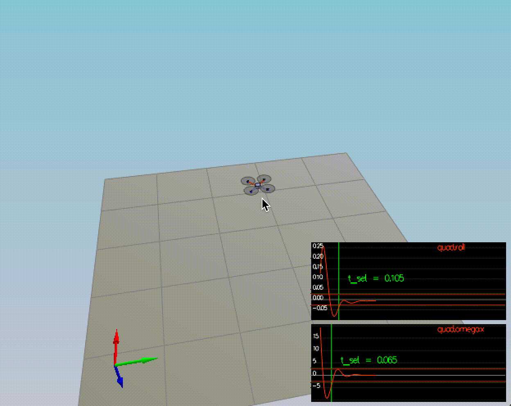
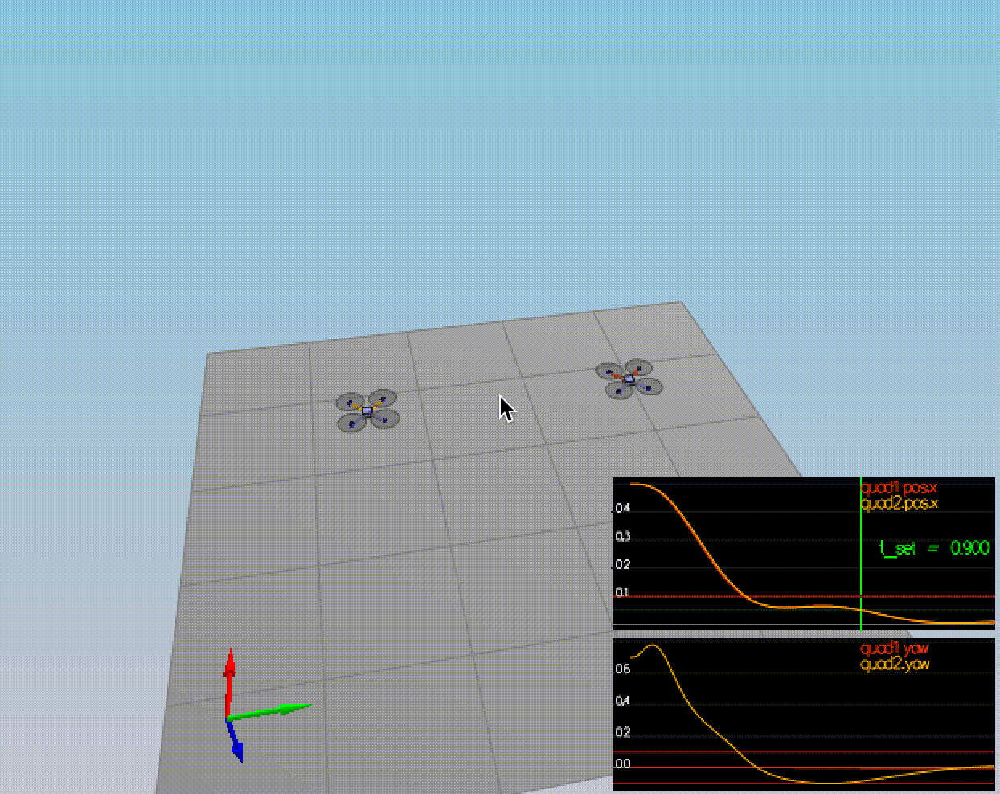
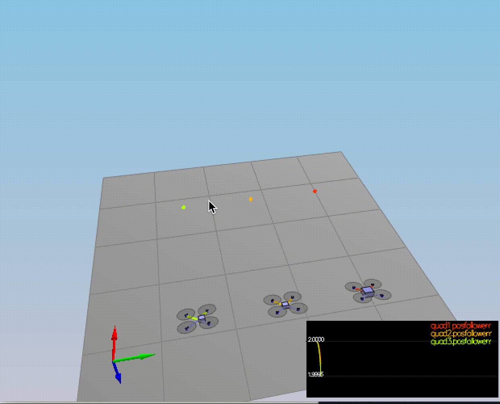

# Building a Controller #

The goal of this project is to implement a low level flight controller in python and after that convert to the C++.

#### The Quadcopter Controls Architecture
Here is the quadcopter controls architecture that we are going to implement:


The altitude controller:


## Python project

The main point of interest in python version is file `controller.py` where you find all things which need to implement 
and tuning params as well. 

Below a list of methods that we implemented are:
* `yaw_control`: a linear / proportional heading controller to yaw rate commands.
* `body_rate_control` a porportional controller on body rates.
* `altitude_control` a controller that uses a down velocity to command thrust. 
* `roll_pitch_controller`: an attitude controller that uses local acceleration commands and outputs body rate commands.
* `lateral_position_control`: a linear position controller using local north east position and local north/east velocity.

## C++ project

C++ version of the controller was turned out to be essentially different. There we have 2 files for updating: `QuadControl.cpp` 
and config file `QuadControlParams.txt`
The process of tuning params I found a bit more convenient for several reasons: 
- the sim app can in runtime to load updated params, so no need restart every time
- quick feedback loop
- stable results on various OS

## 1. Yaw controller 

I found that the Yaw controller was the most simplest from all others. This is a P controller and the equation is fairly simple.

#### Python
Tuning parameters: 
`Kp_yaw`

``` Python
yaw_cmd = np.mod(yaw_cmd, 2.0 * np.pi)

yaw_error = yaw_cmd - yaw

if yaw_error > np.pi:
    yaw_error = yaw_error - 2.0 * np.pi
elif yaw_error < -np.pi:
    yaw_error = yaw_error + 2.0 * np.pi
    
return self.Kp_yaw * yaw_error
```

#### C++
Tuning parameters: 
`kpYaw`

``` C++
yawCmd = remainder(yawCmd, 2.0 * M_PI);

float yawError = yawCmd - yaw;

if (yawError > M_PI)
   yawError = yawError - 2.0 * M_PI;
else if (yawError < -M_PI)
   yawError = yawError + 2.0 * M_PI;

return kpYaw * yawError;
 ```


### 2. Body rate controller
This is another P controller which should take into account the moments of inertia of the drone when calculating the commanded moments.

#### Python
Tuning parameters: 
`Kp_p, Kp_q, Kp_r`

``` Python
p_c, q_c, r_c = body_rate_cmd
p_actual, q_actual, r_actual = body_rate

p_err = p_c - p_actual
u_bar_p = self.Kp_p * p_err

q_err = q_c - q_actual
u_bar_q = self.Kp_q * q_err

r_err = r_c - r_actual
u_bar_r = self.Kp_r * r_err

moment_cmd = np.multiply(MOI, np.array([u_bar_p, u_bar_q, u_bar_r]).T)
```

#### C++
Tuning parameters: 
vector `kpPQR`

``` C++
const V3F rateError = pqrCmd - pqr;
    
momentCmd = kpPQR * rateError;
    
momentCmd = V3F(Ixx, Iyy, Izz) * momentCmd;
```

### 3. Altitude controller
The controller should use both the down position and the down velocity to command thrust.
Additionally, the C++ altitude controller should contain an integrator to handle the weight non-idealities presented in scenario 4.

#### Python
Tuning parameters: 
`altitude_k_p` and `altitude_k_d`

``` Python
rot_mat = euler2RM(attitude[0], attitude[1], attitude[2])

z_err = altitude_cmd - altitude
z_err_dot = vertical_velocity_cmd - vertical_velocity
b_z = rot_mat[2, 2]

p_term = self.altitude_k_p * z_err
d_term = self.altitude_k_d * z_err_dot

u_1_bar = p_term + d_term + acceleration_ff

thrust = (u_1_bar - self.g) / b_z

```

#### C++
Here was used the I (integral) component to help with the different masses of the vehicle as despicted in scenario 4.

Tuning parameters: 
`kpPosZ`,  `kpVelZ` and `KiPosZ`

``` C++
const float z_error = posZCmd - posZ;
const float z_error_dot = velZCmd - velZ;
const float b_z = R(2,2);
    
const float p_term = kpPosZ * z_error;
const float d_term = kpVelZ * z_error_dot;
    
intgAltError = intgAltError + (z_error * dt);
    
const float i_term = KiPosZ * intgAltError;
    
const float u_1_bar = p_term + d_term + accelZCmd + i_term;
    
const float acceleration = (u_1_bar - CONST_GRAVITY) / b_z;
    
thrust = - mass * CONSTRAIN(acceleration, - maxAscentRate / dt, maxAscentRate / dt);
```

### 4. Roll pitch controller
The controller should use the acceleration and thrust commands, in addition to the vehicle attitude to output a body rate command. 
The controller should account for the non-linear transformation from local accelerations to body rates. 

The roll-pitch controller is a P controller responsible for commanding the roll and pitch rates ( `p_c` and `q_c` ) in the body frame. 
It sets the desired rate of change of the given matrix elements using a P controller.

#### Python
Tuning parameters: 
`roll_pitch_k_p_roll` and `roll_pitch_k_p_pitch`

``` Python
# Calculate rotation matrix
rot_mat = euler2RM(attitude[0], attitude[1], attitude[2])

b_x = rot_mat[0, 2]
b_x_err = b_x_c - b_x
b_x_p_term = self.roll_pitch_k_p_roll * b_x_err

b_y = rot_mat[1, 2]
b_y_err = b_y_c - b_y
b_y_p_term = self.roll_pitch_k_p_pitch * b_y_err

b_x_commanded_dot = b_x_p_term
b_y_commanded_dot = b_y_p_term

rot_mat1 = np.array([[rot_mat[1, 0], -rot_mat[0, 0]], [rot_mat[1, 1], -rot_mat[0, 1]]]) / rot_mat[2, 2]

rot_rate = np.matmul(rot_mat1, np.array([b_x_commanded_dot, b_y_commanded_dot]).T)

p_c = rot_rate[0]
q_c = rot_rate[1]
```
The implementation of rotation matrix was provided by Udacity in utility script `frame_utils.by`

#### C++
because of NED coordinate system need to use negative `collThrustCmd` value

Tuning parameters: 
`kpBank`

``` C++
const float b_x = R(0,2);
const float b_x_error = (accelCmd.x / (- collThrustCmd / mass)) - b_x;
const float b_x_commanded_dot = kpBank * b_x_error;
    
const float b_y = R(1,2);
const float b_y_error = (accelCmd.y / (- collThrustCmd / mass)) - b_y;
const float b_y_commanded_dot = kpBank * b_y_error;
    
pqrCmd.x = (R(1,0) * b_x_commanded_dot - R(0,0) * b_y_commanded_dot) / R(2,2);
pqrCmd.y = (R(1,1) * b_x_commanded_dot - R(0,1) * b_y_commanded_dot) / R(2,2);
pqrCmd.z = 0.0;
```

### 5. Lateral position controller
This is an another PD controller in our architecture. It use the local NE position and velocity to generate a commanded local acceleration.
Most challenged controller for me to tune the params.  

#### Python
Tuning parameters: 
`lateral_x_k_p`, `lateral_x_k_d`, `lateral_y_k_p`, and `lateral_y_k_d`

``` Python
x_target, y_target = local_position_cmd
x, y = local_position

x_dot_target, y_dot_target = local_velocity_cmd
x_dot, y_dot = local_velocity

x_dot_dot_target, y_dot_dot_target = acceleration_ff

x_dot_err = x_dot_target - x_dot
x_err = x_target - x
x_dot_dot = self.lateral_x_k_p * x_err + self.lateral_x_k_d * x_dot_err + x_dot_dot_target

y_dot_err = y_dot_target - y_dot
y_err = y_target - y
y_dot_dot = self.lateral_y_k_p * y_err + self.lateral_y_k_d * y_dot_err + y_dot_dot_target
```

#### C++
Tuning parameters: 
`kpPosXY`, `kpVelXY`

We need to constrain the magnitude of calculated values to be no greater than maxSpeedXY and maxAccelXY.
``` C++
velCmd.x = CONSTRAIN(velCmd.x, -maxSpeedXY, maxSpeedXY);
velCmd.y = CONSTRAIN(velCmd.y, -maxSpeedXY, maxSpeedXY);
    
const V3F position_error = posCmd - pos;
const V3F velocity_error = velCmd - vel;
    
const V3F pos_term = kpPosXY * position_error;
const V3F vel_term = kpVelXY * velocity_error;
    
accelCmd = pos_term + vel_term + accelCmd;
accelCmd.x = CONSTRAIN(accelCmd.x, -maxAccelXY, maxAccelXY);
accelCmd.y = CONSTRAIN(accelCmd.y, -maxAccelXY, maxAccelXY);
```


### 6. Calculating the motor commands
The thrust and moments should be converted to the appropriate 4 different desired thrust forces for the moments.

Actually, this is was a starter point of the C++ Controls. 
Here need to convert a desired 3-axis moment and collective thrust to individual motor thrust commands.

#### C++
Tuning parameters: 
`Kp_yaw`

``` C++
const float f = collThrustCmd;
const float t_x = momentCmd.x;
const float t_y = momentCmd.y;
const float t_z = momentCmd.z;
    
const float l = L/sqrt(2.0);
  
cmd.desiredThrustsN[0] = (f + t_x / l + t_y / l - t_z / kappa) / 4.f; // front left
cmd.desiredThrustsN[1] = (f - t_x / l + t_y / l + t_z / kappa) / 4.f; // front right
cmd.desiredThrustsN[2] = (f + t_x / l - t_y / l + t_z / kappa) / 4.f; // rear left
cmd.desiredThrustsN[3] = (f - t_x / l - t_y / l - t_z / kappa) / 4.f; // rear right
```

## Evaluation
The drone can flies the test trajectory by executing `python controls_flyer.py`.



### Intro (scenario 1)
The goal of the first scenario is to set a correct mass for hovering.

PASS: ABS(Quad.PosFollowErr) was less than 0.500000 for at least 0.800000 seconds

### Body rate and roll/pitch control (scenario 2)
The requirement is to stop spinning the drone.


PASS: ABS(Quad.Roll) was less than 0.025000 for at least 0.750000 seconds
PASS: ABS(Quad.Omega.X) was less than 2.500000 for at least 0.750000 seconds

### Position/velocity and yaw angle control (scenario 3)
The altitude, position and yaw are tested. Here two identical drones but first one initialized with yaw = 0, next with yaw = 45 


PASS: ABS(Quad1.Pos.X) was less than 0.100000 for at least 1.250000 seconds
PASS: ABS(Quad2.Pos.X) was less than 0.100000 for at least 1.250000 seconds
PASS: ABS(Quad2.Yaw) was less than 0.100000 for at least 1.000000 seconds

### Non-idealities and robustness (scenario 4)
The robustness of the controller is tested. Three quads are all trying to move one meter forward.

* The green quad has its center of mass shifted back
* The orange vehicle is an ideal quad
* The red vehicle is heavier than usual


PASS: ABS(Quad1.PosFollowErr) was less than 0.100000 for at least 1.500000 seconds
PASS: ABS(Quad2.PosFollowErr) was less than 0.100000 for at least 1.500000 seconds
PASS: ABS(Quad3.PosFollowErr) was less than 0.100000 for at least 1.500000 seconds

### Follow trajectory (scenario 5)
The drones tries to follow a given trajectory.


PASS: ABS(Quad2.PosFollowErr) was less than 0.250000 for at least 3.000000 seconds

#### Total:
The project was quite challenged for me because of many params need manually change and keep in mind. Also, need 
to work with two different dev environments, languages and simulators.